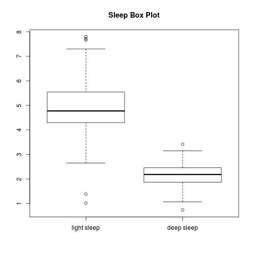
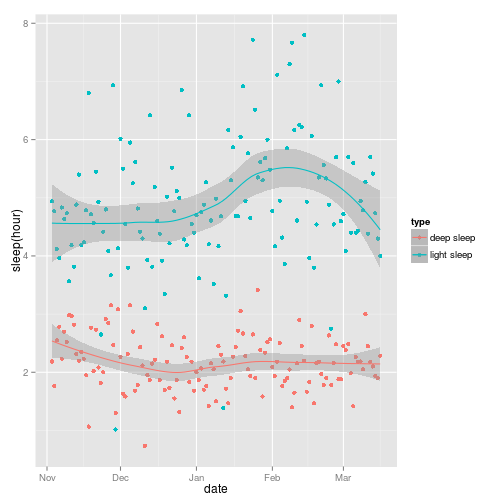

# Overview
This report conducts data analysis of Xiaomi Mi Band's data from android sqlite database. 

# Data
For personalized purpose, the data can be obtained from android phone's path "/data/data/com.xiaomi.hm.health". Note that you need root access to copy files in the directory. Use RootExplorer to copy the whole directory named "databases" to R working directory.

# Load Libraries  

```r
library(DBI)
library(RSQLite)
library(jsonlite)
library(ggplot2)
library(gridExtra)
library(dplyr)
```

# Read Database File  
Using SQLite library to read in sqlite database file

```r
setwd("./databases")
userid<-"963276123"
filename<-paste("origin_db",userid,sep = "_")
sqlite    <- dbDriver("SQLite")
sourcedb <- dbConnect(sqlite,filename)
sourceData <- dbGetQuery(sourcedb,"select * from date_data")
setwd("..")
```
  
# Data Cleaning
Data is written in json form, thus using fromJSON and "[[" function to extract data from json. To make things clearer, bind useful date(date, light sleep, deep sleep and steps) together as a data frame called "cleanData."

```r
sourceData$DATE<-as.Date(sourceData$DATE,"%Y-%m-%d")
jsondata<-sapply(sourceData$SUMMARY,fromJSON)
slp<-jsondata[1,]
stp<-jsondata[4,]
lightsleep<-unname( unlist( lapply(slp,"[[","lt") )  )   ##extract elements from list of list
deepsleep<-unname( unlist( lapply(slp,"[[","dp") )  )
totalstep<-unname( unlist( lapply(stp,"[[","ttl") ) )
cleanData <- data.frame(date=sourceData$DATE,sleep.light=lightsleep,sleep.deep=deepsleep,step=totalstep)
cleanData<-dplyr::arrange(cleanData,date)
```

## Missing Data Replacement  
Filling in missing value with mean value for the same day of a week.

```r
cleanData$weekday<-weekdays(cleanData$date)
groupeddata<-group_by(cleanData,weekday)
avgs<-summarize(groupeddata,sleep.light=mean(sleep.light[sleep.light!=0]),sleep.deep=mean(sleep.deep[sleep.deep!=0]),step=mean(step[step!=0]))
replace <- function(rowunit,avgs){
        for( col in 1:ncol(rowunit) ){
                if(rowunit[,col]==0){
                        rowunit[,col]<-avgs[avgs[,1]==rowunit$weekday,col]
                }
        }
        rowunit
}
completedata<-by(cleanData,1:nrow(cleanData),function(rowunit) replace(rowunit,avgs))
completedata<-as.data.frame(do.call("rbind",completedata))
```
  
# Exploratory Data Analysis


```r
head(completedata)
```

```
##         date sleep.light sleep.deep  step   weekday
## 1 2015-11-03    296.3889   131.1176  1015   Tuesday
## 2 2015-11-04    286.0000   106.0000 13743 Wednesday
## 3 2015-11-05    247.0000   153.0000 11000  Thursday
## 4 2015-11-06    238.0000   167.0000 14548    Friday
## 5 2015-11-07    290.0000   134.0000 10582  Saturday
## 6 2015-11-08    278.0000   162.0000 10334    Sunday
```
The data frame has four columns called date, sleep.light, sleep.deep and step. The unit of time duration is minute.


```r
datedur<-range(completedata$date)
nrow<-nrow(completedata)
summary(completedata$sleep.light)
```

```
##    Min. 1st Qu.  Median    Mean 3rd Qu.    Max. 
##    61.0   257.5   286.4   295.6   332.5   468.0
```

```r
summary(completedata$sleep.deep)
```

```
##    Min. 1st Qu.  Median    Mean 3rd Qu.    Max. 
##    44.0   112.0   131.0   130.1   147.5   205.0
```

```r
summary(completedata$step)
```

```
##    Min. 1st Qu.  Median    Mean 3rd Qu.    Max. 
##     642    4154    7138    7051    9900   16770
```
The date frame records data frome 2015-11-03 to 2016-03-16 and has 135 rows.  
  
Plotting:

```r
boxplot(completedata$sleep.light/60,completedata$sleep.deep/60,names = c("light sleep","deep sleep"))
```

 

```r
ggplot(data=completedata,aes(x=date,y=value,col=type))+geom_point(aes(y=sleep.light,col="light sleep"))+geom_point(aes(y=sleep.deep,col="deep sleep"))
```

 

```r
ggplot(data=completedata,aes(x=date,y=step))+geom_point()+geom_smooth(method="auto")+labs(title="Steps")
```

 
  
# Which day of a week has the highest value? Which day of a week has the lowest value?

```r
groupeddata<-group_by(completedata,weekday)
avgs<-summarize(groupeddata,sleep.light=mean(sleep.light[sleep.light!=0]),sleep.deep=mean(sleep.deep[sleep.deep!=0]),step=mean(step[step!=0]))
avgs<-avgs[c(4,2,6,7,5,1,3),] #sort by weekday

p1<-ggplot(data=avgs,aes(x=weekday,y=sleep,col="type"))+geom_line(aes(y=sleep.light,group=1,col="light sleep"))+geom_line(aes(y=sleep.deep,group=1,col="deep sleep"))+labs(title="Sleep Averages")
p2<-ggplot(data=avgs,aes(x=weekday,y=step))+geom_line(aes(group=1))+labs(title="Step Averages")
grid.arrange(p1,p2,ncol=2)
```

 

```r
maxindex<-data.frame()
for(col in 2:ncol(avgs)){
        if(col=="sleep.light") maxindex<-t(avgs[,col]==max(avgs[,col]))
        maxindex<-rbind(maxindex,t(avgs[,col]==max(avgs[,col])))
}
max<-c()
for(row in 1:nrow(maxindex)){
        max<-c(max,avgs[as.numeric(maxindex[row,])==1,1])
}
names(max)<-rownames(maxindex)
```
In the order of sleep.light, sleep.deep, step, Saturday, Sunday, Monday have the highest value.

# Is the step value of scool days different from that of vacation.

```r
completedata$month<-months(completedata$date)
vacation<-completedata[completedata$month %in% c("January","February","July","August"),]
schoolday<-completedata[!completedata$month %in% c("January","February","July","August"),]
boxplot(vacation$step,schoolday$step,names = c("vacation","school"))
title(main="Step")
```

 
  
As shown in the boxplot, mean step of school day is higher than that of vacation.


```r
schoolresample<-matrix(sample(schoolday$step,1000,replace=T),nrow=100)
schoolmedian<-apply(schoolresample,1,median)
vacationresample<-matrix(sample(vacation$step,1000,replace = T),nrow = 100)
vacationmedian<-apply(vacationresample,1,median)
testresult<-t.test(schoolmedian,vacationmedian)
```
We are 1-2.5303887 &times; 10<sup>-66</sup> confident to say step of school day is different from that of vacation.
