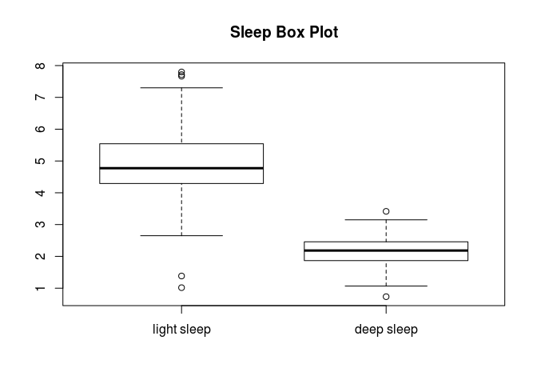
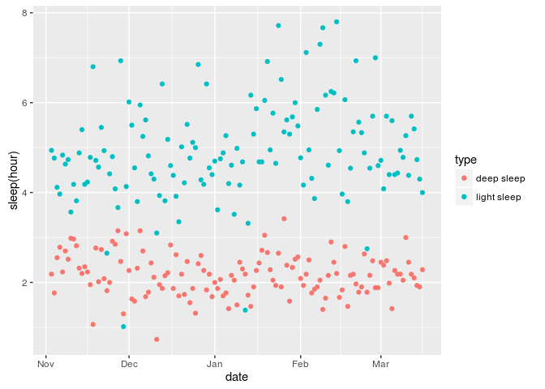
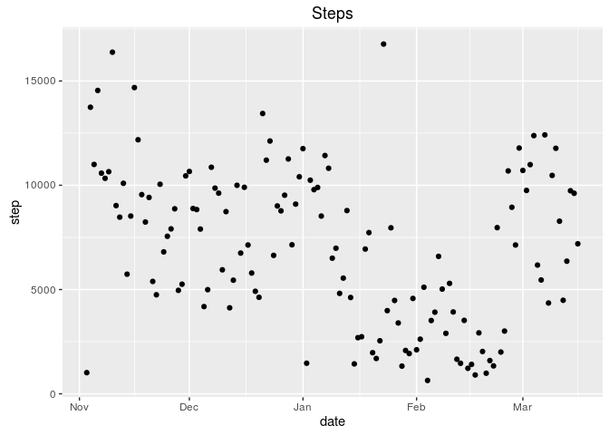
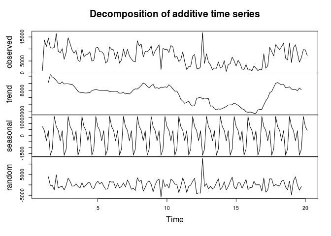
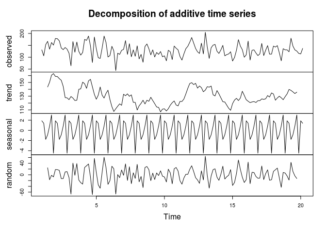
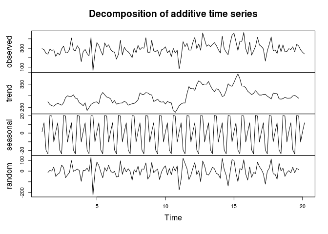
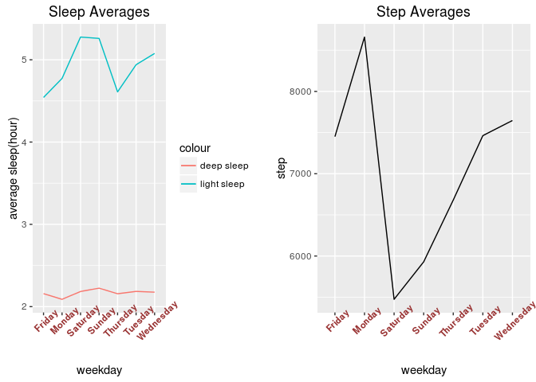
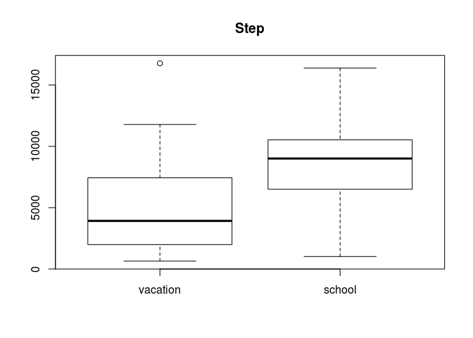
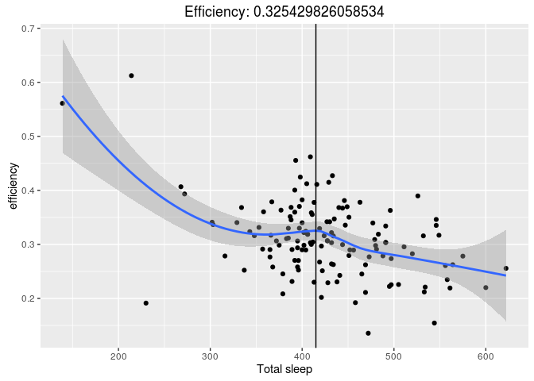
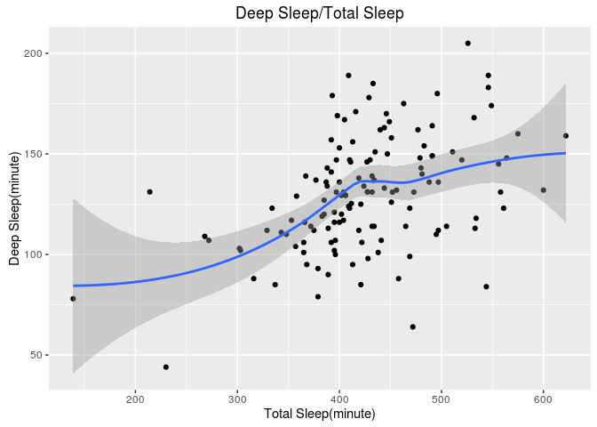

Overview
========

This report conducts data analysis of Xiaomi Mi Band's data from android
sqlite database.

Data
====

For personalized purpose, the data can be obtained from android phone's
path "/data/data/com.xiaomi.hm.health". Note that you need root access
to copy files in the directory. Use RootExplorer to copy the whole
directory named "databases" to R working directory. Data used for this
report can be accessed from [github](https://github.com/BigBorg/MiBand)

Load Libraries
==============

    library(DBI)
    library(RSQLite)
    library(jsonlite)
    library(ggplot2)
    library(gridExtra)
    library(dplyr)

Read Database File
==================

Using SQLite library to read in sqlite database file. Replace userid if
you are running code to analyze your own data. You can find userid in
Xiaomi Mi Band app.

    setwd("./databases")
    userid<-"963276123"
    filename<-paste("origin_db",userid,sep = "_")
    sqlite    <- dbDriver("SQLite")
    sourcedb <- dbConnect(sqlite,filename)
    sourceData <- dbGetQuery(sourcedb,"select * from date_data")
    setwd("..")

Data Cleaning
=============

Data is written in json form, thus using fromJSON and "[[" function to
extract data from json. To make things clearer, bind useful date(date,
light sleep, deep sleep and steps) together as a data frame called
"cleanData."

    sourceData$DATE<-as.Date(sourceData$DATE,"%Y-%m-%d")
    jsondata<-sapply(sourceData$SUMMARY,fromJSON)
    slp<-jsondata[1,]
    stp<-jsondata[4,]
    lightsleep<-unname( unlist( lapply(slp,"[[","lt") )  )   ##extract elements from list of list
    deepsleep<-unname( unlist( lapply(slp,"[[","dp") )  )
    totalstep<-unname( unlist( lapply(stp,"[[","ttl") ) )
    cleanData <- data.frame(date=sourceData$DATE,sleep.light=lightsleep,sleep.deep=deepsleep,step=totalstep)
    cleanData<-dplyr::arrange(cleanData,date)

Missing Data Replacement
------------------------

Filling in missing value with mean value for the same day of a week.

    cleanData$weekday<-weekdays(cleanData$date)
    groupeddata<-group_by(cleanData,weekday)
    avgs<-summarize(groupeddata,
                    sleep.light=mean(sleep.light[sleep.light!=0]),
                    sleep.deep=mean(sleep.deep[sleep.deep!=0]),
                    step=mean(step[step!=0]))
    replace <- function(rowunit,avgs){
            for( col in 1:ncol(rowunit) ){
                    if(rowunit[,col]==0){
                            rowunit[,col]<-avgs[avgs[,1]==rowunit$weekday,col]
                    }
            }
            rowunit
    }
    completedata<-by(cleanData,1:nrow(cleanData),function(rowunit) replace(rowunit,avgs))
    completedata<-as.data.frame(do.call("rbind",completedata))

Exploratory Data Analysis
=========================

    head(completedata)

    ##         date sleep.light sleep.deep  step   weekday
    ## 1 2015-11-03    296.3889   131.1176  1015   Tuesday
    ## 2 2015-11-04    286.0000   106.0000 13743 Wednesday
    ## 3 2015-11-05    247.0000   153.0000 11000  Thursday
    ## 4 2015-11-06    238.0000   167.0000 14548    Friday
    ## 5 2015-11-07    290.0000   134.0000 10582  Saturday
    ## 6 2015-11-08    278.0000   162.0000 10334    Sunday

The data frame has four columns called date, sleep.light, sleep.deep and
step. The unit of time duration is minute.

    datedur<-range(completedata$date)
    nrow<-nrow(completedata)
    summary(completedata$sleep.light)

    ##    Min. 1st Qu.  Median    Mean 3rd Qu.    Max. 
    ##    61.0   257.5   286.4   295.6   332.5   468.0

    summary(completedata$sleep.deep)

    ##    Min. 1st Qu.  Median    Mean 3rd Qu.    Max. 
    ##    44.0   112.0   131.0   130.1   147.5   205.0

    summary(completedata$step)

    ##    Min. 1st Qu.  Median    Mean 3rd Qu.    Max. 
    ##     642    4154    7138    7051    9900   16770

The date frame records data frome 2015-11-03 to 2016-03-16 and has 135
rows.

Plotting:

    boxplot(completedata$sleep.light/60,completedata$sleep.deep/60,names = c("light sleep","deep sleep"))
    title("Sleep Box Plot")

<!-- -->

    ggplot(data=completedata,aes(x=date,y=value,col=type))+
            geom_point(aes(y=sleep.light/60,col="light sleep"))+
            geom_point(aes(y=sleep.deep/60,col="deep sleep"))+
            #geom_smooth(aes(y=sleep.light/60,col="light sleep"))+
            #geom_smooth(aes(y=sleep.deep/60,col="deep sleep"))+
            labs(y="sleep(hour)")

<!-- -->

    ggplot(data=completedata,aes(x=date,y=step))+
            geom_point()+
            #geom_smooth(method="auto")+
            labs(title="Steps")

<!-- -->

Time Sequence Analysis
======================

Time sequence analysis on steps:

    weekly_ts_analysis <- function(data){
            tsobj <- ts(data,start=1,frequency=7)
            components <- decompose(tsobj)
            plot(components)
    }
    weekly_ts_analysis(completedata$step)

<!-- -->

Time sequence analysis on deep sleep:

    weekly_ts_analysis(completedata$sleep.deep)

<!-- -->

Time sequence analysis on light sleep:

    weekly_ts_analysis(completedata$sleep.light)

<!-- -->

Which day of a week has the highest value?
==========================================

    groupeddata<-group_by(completedata,weekday)
    #avgs<-summarize(groupeddata,
    #                sleep.light=mean(sleep.light[sleep.light!=0]),
    #                sleep.deep=mean(sleep.deep[sleep.deep!=0]),
    #                step=mean(step[step!=0]))
    avgs<-avgs[c(4,2,6,7,5,1,3),] #sort by weekday

    p1<-ggplot(data=avgs,aes(x=weekday,y=sleep/60,col="type"))+
            geom_line(aes(y=sleep.light/60,group=1,col="light sleep"))+
            geom_line(aes(y=sleep.deep/60,group=1,col="deep sleep"))+
            labs(title="Sleep Averages")+
            labs(y="average sleep(hour)")+
            theme(axis.text.x = element_text(face="bold", color="#993333",angle=45))
    p2<-ggplot(data=avgs,aes(x=weekday,y=step))+
            geom_line(aes(group=1))+
            labs(title="Step Averages")+
            theme(axis.text.x = element_text(face="bold", color="#993333",angle=45))
    grid.arrange(p1,p2,ncol=2)

<!-- -->

    maxindex<-data.frame()
    for(col in 2:ncol(avgs)){
            if(col=="sleep.light") 
                    maxindex<-t(avgs[,col]==max(avgs[,col]))
            maxindex<-rbind(maxindex,t(avgs[,col]==max(avgs[,col])))
    }
    max<-c()
    for(row in 1:nrow(maxindex)){
            max<-c(max,avgs[as.numeric(maxindex[row,])==1,1])
    }
    names(max)<-rownames(maxindex)

In the order of sleep.light, sleep.deep, step, Saturday, Sunday, Monday
have the highest value.

Is the step value of scool days different from that of vacation.
================================================================

    completedata$month<-months(completedata$date)
    vacation<-completedata[completedata$month %in% c("January","February","July","August"),]
    schoolday<-completedata[!completedata$month %in% c("January","February","July","August"),]
    boxplot(vacation$step,schoolday$step,names = c("vacation","school"))
    title(main="Step")

<!-- -->

As shown in the boxplot, mean step of school day is higher than that of
vacation.

    set.seed(0)
    schoolresample<-matrix(sample(schoolday$step,1000,replace=T),nrow=100)
    schoolmean<-apply(schoolresample,1,mean)
    vacationresample<-matrix(sample(vacation$step,1000,replace = T),nrow = 100)
    vacationmean<-apply(vacationresample,1,mean)
    testresult<-t.test(schoolmean,vacationmean)
    difference<-mean(schoolmean)-mean(vacationmean)

We are 1-2.856376510^{-56} confident to say step of school day is
different from that of vacation. The mean difference is 3542.476(school
Mean - Vacation Mean).

Is there corelationship between sleep and step?
===============================================

    completedata$efficiency<-with(completedata,sleep.deep/(sleep.deep+sleep.light))
    cors<-with(completedata,c(
            cor(step,sleep.light),
            cor(step,sleep.deep),
            cor(step,sleep.light+sleep.deep),
            cor(step,efficiency)
            )
    )
    names(cors)<-c("step-sleep.light","step-sleep.deep","step-total sleep","step-efficiency")
    cors

    ## step-sleep.light  step-sleep.deep step-total sleep  step-efficiency 
    ##      -0.26818421       0.01967599      -0.23354983       0.16616874

Corelationship indicates that the longer you sleep, the fewer you are
likely to walk. But such corelationship is quit weak. Note that within
one row, which means on the same day, step of that day happens after
sleep.

The longer you sleep, the higher efficiency of sleep you have?
==============================================================

    with(completedata,cor(sleep.deep+sleep.light,efficiency))

    ## [1] -0.4311479

The longer you sleep, the lower efficiency of sleep you have.

At which point of total sleep you get highest sleep efficiency?
===============================================================

    # Use manipulate if you are copy-pasting code to R studio environment
    # manipulate({
    #        Y<-predict(loess(effciiency~I(sleep.light+sleep.deep),data=completedata),M)
    #        ggplot(data=completedata,aes(sleep.light+sleep.deep,efficiency))+
    #                geom_point()+geom_smooth(method="auto")+
    #                geom_vline(x=M)+labs(x="Total sleep")+labs(title=paste("Efficiency: 
    # ",Y,sep=""))
    #    },
    #    M=slider(
    #            min(completedata$sleep.light+completedata$sleep.deep),
    #            max(completedata$sleep.light+completedata$sleep.deep),
    #            initial = min(completedata$sleep.light+completedata$sleep.deep)
    #            )
    #)
    Y<-predict(loess(efficiency~I(sleep.light+sleep.deep),data=completedata),415)
            ggplot(data=completedata,aes(sleep.light+sleep.deep,efficiency))+
                    geom_point()+geom_smooth(method="auto")+
                    geom_vline(xintercept=415)+labs(x="Total sleep")+
                    labs(title=paste("Efficiency: ",Y,sep=""))

<!-- -->

The efficiency is extremely high when the total sleep is less than 300.
That might be the body trying to compensate loss of total sleep time by
increasing deep sleep percentage. Though efficiency is high when you
sleep for less than 300 minutes, deep sleep duration is not sufficent
for the total sleep duration is short. At about 415 minutes, we see a
slightly high efficiency relatively. Then efficiency goes downward again
when you sleep for longer than that.

Relationship between total sleep duration and deep sleep duration
=================================================================

    ggplot(data=completedata,aes(x=sleep.light+sleep.deep,y=sleep.deep))+
                    geom_point()+
                    geom_smooth(method="auto")+
                    labs(title="Deep Sleep/Total Sleep",x="Total Sleep(minute)",y="Deep Sleep(minute)")

<!-- -->
Again, using deep sleep duration to evaluate sleep quality, the turning
point is still at about 415 minutes.

Use total light sleep and deep sleep to predict step
====================================================

       coefs<-summary(lm(step~sleep.light+sleep.deep,data=completedata))$coefficient

One minute increase of light sleep leads to -15.2790414 change of step.
One minute increase of deep sleep leads to 5.4226326 change of step.

Conclusion
==========

The subject sleep longer on Sunday and walk more on Monday. Step of
school day is different from that of vacation. There is a weak
corelation between sleep and step. Around 7 hours' sleep has the
relative high efficiency of sleep(deep sleep/total sleep).
